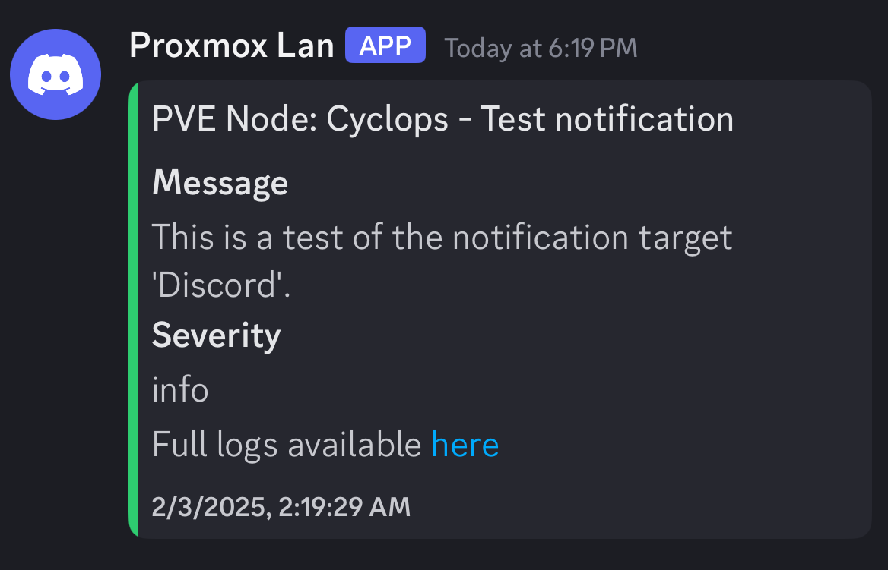
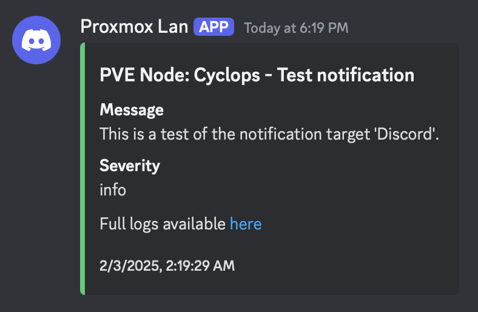
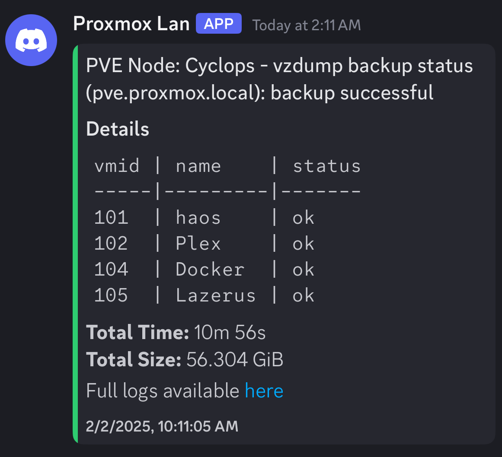
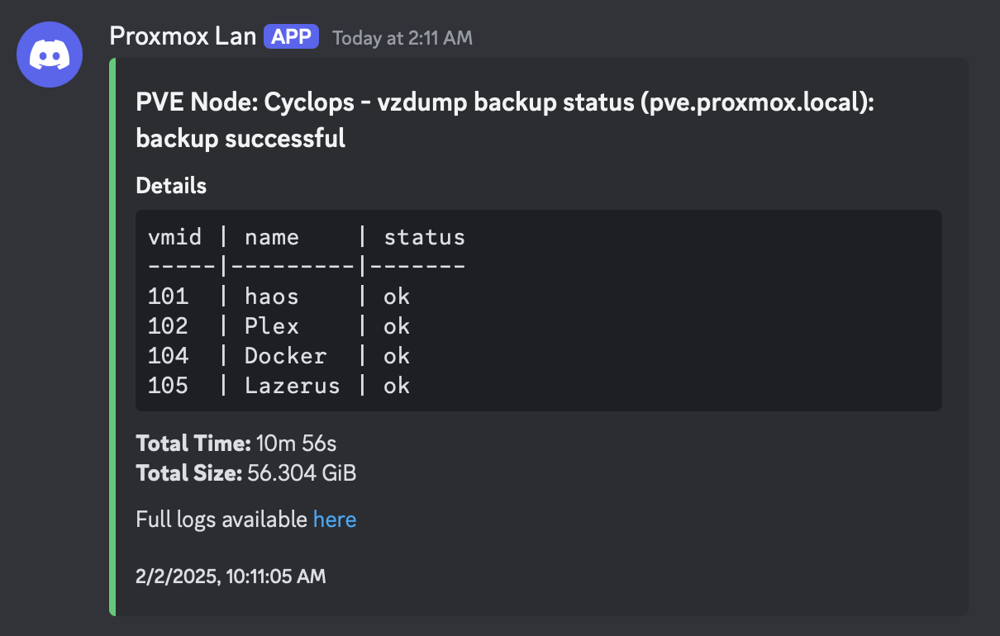

# Proxmox VE Webhook Discord Proxy

> Docker image for a Discord Webhook Proxy designed for Proxmox VE notifications

[GitHub repository](https://github.com/V-Shadbolt/pve-discord-proxy)

[Docker Hub](https://hub.docker.com/r/vshadbolt/pve-discord-proxy)

[](https://hub.Docker.com/r/vshadbolt/pve-discord-proxy)

---

This service processes backup and general notifications from Proxmox Virtual Environment (PVE) nodes and forwards them to Discord through webhooks. It provides detailed backup information in a formatted Discord embed, including VM details, backup status, and total backup statistics.

**Screenshots**  
| Mobile Generic Notification | Desktop Generic Notification | Mobile Backup Notification | Desktop Backup Notification | 
:-------------------------:|:-------------------------:|:-------------------------:|:-------------------------:|
 |  |  | 

## Installation Options

### Docker Installation (Recommended)

The easiest way to run this service is using Docker. The image is available on Docker Hub as `vshadbolt/pve-discord-proxy`.

1. Pull the Docker image:
```bash
docker pull vshadbolt/pve-discord-proxy
```

2. Run the container:
```bash
docker run -d \
  -p 80:80 \
  -e DISCORD_WEBHOOK_URL=your_webhook_url \
  -e LOG_RETENTION_DAYS=3 \
  -e TIMEZONE=America/Vancouver \
  vshadbolt/pve-discord-proxy
```

To persist logs across container restarts, mount a volume to the `/app/logs` directory:
```bash
docker run -d \
  -p 80:80 \
  -e DISCORD_WEBHOOK_URL=your_webhook_url \
  -e LOG_RETENTION_DAYS=3 \
  -e TIMEZONE=America/Vancouver \
  -v /path/to/logs:/app/logs \
  vshadbolt/pve-discord-proxy
```

### Manual Installation

If you prefer to run the service directly on your system, follow these steps:

1. Clone the repository and install dependencies:
```bash
npm install
```

2. Create a `.env` file in the project root with the following variables or otherwise use the provided `.env.example`:
```
PORT=80                       # Port for the webhook service
DISCORD_WEBHOOK_URL=          # Default Discord webhook URL
LOG_RETENTION_DAYS=3          # Number of days to retain logs
TIMEZONE=America/Vancouver    # Timezone of your host
```

## Environment Variables

The service can be configured using the following environment variables:

| Variable | Description | Default |
|----------|-------------|---------|
| `PORT` | Port the service listens on | 80 |
| `DISCORD_WEBHOOK_URL` | Default Discord webhook URL | Required |
| `LOG_RETENTION_DAYS` | Number of days to keep logs | 3 |
| `TIMEZONE` | Timezone of the host | UTC |

You can retireve your Discrod webhook URL by following the [Discord Webhook Guide](https://support.discord.com/hc/en-us/articles/228383668-Intro-to-Webhooks).

## Usage

### Starting the Service

If using Docker Compose, create a `docker-compose.yml`:
```yaml
services:
  discord-proxy:
    image: vshadbolt/pve-discord-proxy
    ports:
      - "80:80"
    environment:
      - DISCORD_WEBHOOK_URL=your_webhook_url
      - LOG_RETENTION_DAYS=3
      - TIMEZONE=America/Vancouver
    volumes:
      - ./logs:/app/logs
    restart: unless-stopped
```

Then run:
```bash
docker-compose up -d
```

If running manually:
```bash
node app.js
```

### Sending Webhook Requests

In Proxmox 8.3.3 or higher, setup a notification webhook that sends POST requests to `http://localhost:80/webhook` with the below JSON body. Replace `http://localhost:80` with the appropriate URL for where you're hosting the proxy. Ensure you also set the `Content-Type: application/json` header.

```json
{
  "discordWebhook": "https://discord.com/api/webhooks/...",  // Optional, overrides env variable
  "messageContent": "Backup log content...",
  "urlLogAccessible": "https://your-domain.com/",
  "severity": "info",
  "messageTitle": "Backup Complete",
  "node": "pve-node-1"                                       // Optional, defaults to 'pve'
}
```

If you have multiple nodes, setup multiple webhooks with the appropriate `node` name for easy differentiation in Discord. Alternatively, you can override the `DISCORD_WEBHOOK_URL` in your `.env` file by specifying it in the notification body above.

Test the notification target directly in the Proxmox GUI.

Note that the webhook will not be used until you create a notification matcher.

### Message Severity Colors

The service uses different colors for Discord embeds based on severity:
- Info: Green
- Error: Red
- Unknown: Yellow
- Default: Grey

### Log Management

- Logs are stored in the `logs` directory
- File naming format: `YYYY-MM-DD.HH-MM-SS.log` aligned with your provided timezone.
- Logs older than `LOG_RETENTION_DAYS` are automatically deleted
- Logs are accessible through `/logs` endpoint

## Error Handling

The service implements a two-tier messaging system:
1. Attempts to send a detailed embed with information
2. Falls back to a simplified embed if Discord's character limits are exceeded

## API Endpoints

- `POST /webhook`: Receives notifications from Proxox
- `GET /logs/*`: Serves log files

## Development

### Contributing

1. Fork the repository
2. Create a feature branch
3. Submit a pull request

## Docker Image Updates

The Docker image is automatically built and published to Docker Hub whenever changes are pushed to the main branch. You can always pull the latest version using:

```bash
docker pull vshadbolt/pve-discord-proxy
```
